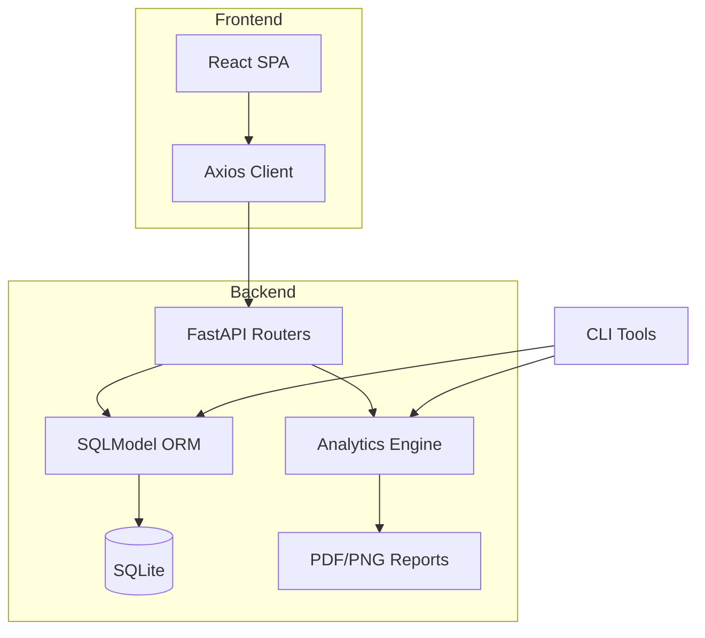

# RELIABASE — Reliability Engineering Tracking & Analysis

<p align="center">
  <strong>Local-first reliability database + analytics engine for assets, events, exposures, and parts.</strong><br>
  Outputs MTBF/MTTR, availability, Weibull fits, reliability curves, and produces exportable reports (PDF/CSV).
</p>

---

## 🚀 Quick Start

### Prerequisites
- **Python 3.11+** (for backend)
- **Node.js 18+** (for frontend)
- Git

### Installation

```bash
# Clone the repository
git clone https://github.com/eboicey/RELIABASE.git
cd RELIABASE

# Create and activate Python virtual environment
python -m venv .venv

# Windows PowerShell:
.venv\Scripts\Activate.ps1

# macOS/Linux:
source .venv/bin/activate

# Install Python dependencies
pip install -r requirements.txt

# Install frontend dependencies
cd frontend
npm install
cd ..
```

### Running the Application

**You need TWO terminal windows running simultaneously:**

#### Terminal 1 — Backend (FastAPI)
```bash
# From the RELIABASE root directory
uvicorn reliabase.api.main:app --host 127.0.0.1 --port 8000 --reload
```
The API will be available at **http://localhost:8000**

#### Terminal 2 — Frontend (React + Vite)
```bash
# From the frontend directory
cd frontend
npm run dev
```
The UI will be available at **http://localhost:5173**

### First-Time Setup: Seed Demo Data

With the backend running, seed the database with sample data:

**Option A — Via CLI (new terminal):**
```bash
python -m reliabase.seed_demo
```

**Option B — Via UI:**
1. Open http://localhost:5173
2. Navigate to **Operations** in the left sidebar
3. Click **"Seed demo data"** button

### Generate a Reliability Report

```bash
python -m reliabase.make_report --asset-id 1 --output-dir ./examples
```
This creates a PDF report + PNG charts in the `examples/` folder.

---

## 📚 Stack

| Layer | Technology |
|-------|-----------|
| **Backend** | Python 3.11+, FastAPI, SQLModel, SQLite |
| **Frontend** | React 18, TypeScript, Vite, TailwindCSS |
| **Analytics** | Pandas, NumPy, SciPy (Weibull MLE) |
| **Reporting** | Matplotlib (plots), ReportLab (PDF) |
| **Testing** | Pytest (30+ tests) |

---

## 🏗️ Architecture



---

## 📊 Data Model

| Entity | Key Fields |
|--------|-----------|
| **Asset** | id, name, type, serial, in_service_date, notes |
| **ExposureLog** | asset_id, start_time, end_time, hours, cycles |
| **Event** | asset_id, timestamp, event_type (failure/maintenance/inspection), downtime_minutes, description |
| **FailureMode** | name, category |
| **EventFailureDetail** | event_id, failure_mode_id, root_cause, corrective_action, part_replaced |
| **Part** | name, part_number |
| **PartInstall** | asset_id, part_id, install_time, remove_time |

---

## ✨ Features

### Core Functionality
- ✅ Full CRUD for assets, exposures, events, failure modes, parts, and installs
- ✅ Real-time dashboard with KPI cards and recent events table
- ✅ Asset filtering across all analytics views

### Analytics
- ✅ **MTBF** (Mean Time Between Failures) — censor-aware calculation
- ✅ **MTTR** (Mean Time To Repair) — from downtime minutes
- ✅ **Availability** — computed from MTBF and MTTR
- ✅ **Weibull Analysis** — 2-parameter MLE with bootstrap confidence intervals
- ✅ **Reliability & Hazard Curves** — visual plots with right-censoring support
- ✅ **Failure Mode Pareto** — ranked failure causes

### Reporting & Export
- ✅ PDF reliability packet with KPI summary, plots, and event timeline
- ✅ CSV export for all tables (via UI or CLI)
- ✅ PNG chart exports (Weibull curves, Pareto, timeline)

---

## 📐 Formulas

| Metric | Formula |
|--------|---------|
| **MTBF** | Total operating hours ÷ Number of failures |
| **MTTR** | Total downtime (hours) ÷ Number of failures |
| **Availability** | MTBF ÷ (MTBF + MTTR) |
| **Weibull PDF** | f(t) = (β/η)(t/η)^(β-1) × e^(-(t/η)^β) |

Where β = shape parameter, η = scale parameter. Right-censored observations handled in MLE. Confidence intervals via bootstrap (N=1000 resamples).

---

## 🗂️ Project Structure

```
RELIABASE/
├── src/reliabase/           # Python package
│   ├── api/                 # FastAPI routers
│   ├── analytics/           # MTBF, MTTR, Weibull calculations
│   ├── io/                  # CSV import/export
│   ├── models.py            # SQLModel definitions
│   ├── config.py            # Database configuration
│   ├── seed_demo.py         # Demo data generator
│   └── make_report.py       # PDF report generator
├── frontend/                # React application
│   ├── src/
│   │   ├── api/             # API client & types
│   │   ├── components/      # Reusable UI components
│   │   ├── pages/           # Route pages
│   │   └── layouts/         # Shell layout
│   └── package.json
├── tests/                   # Pytest test suite
├── examples/                # Generated reports & exports
├── requirements.txt         # Python dependencies
└── pyproject.toml           # Python package metadata
```

---

## 🧪 Running Tests

```bash
# Run all tests
pytest

# Run with verbose output
pytest -v

# Run specific test file
pytest tests/test_analytics.py
```

---

## 🔌 API Endpoints

| Endpoint | Methods | Description |
|----------|---------|-------------|
| `/health` | GET | Health check |
| `/assets/` | GET, POST | List/create assets |
| `/assets/{id}` | GET, PATCH, DELETE | Asset CRUD |
| `/exposures/` | GET, POST | List/create exposure logs |
| `/events/` | GET, POST | List/create events |
| `/failure-modes/` | GET, POST | List/create failure modes |
| `/event-details/` | GET, POST | List/create event failure details |
| `/parts/` | GET, POST | List/create parts |
| `/parts/{id}/installs` | GET, POST | Part installation history |
| `/demo/seed` | POST | Seed demo data (reset optional) |

Full API docs available at **http://localhost:8000/docs** when backend is running.

---

## ⚙️ Configuration

### Environment Variables

| Variable | Default | Description |
|----------|---------|-------------|
| `RELIABASE_DB` | `./reliabase.sqlite` | SQLite database file path |
| `RELIABASE_DATABASE_URL` | `sqlite:///./reliabase.sqlite` | Full database URL |
| `RELIABASE_CORS_ORIGINS` | `http://localhost:5173,...` | Allowed CORS origins (comma-separated) |
| `RELIABASE_ECHO_SQL` | `false` | Log SQL queries |
| `VITE_API_URL` | `http://localhost:8000` | Backend URL for frontend |

---

## 📖 Usage Examples

### Export Tables to CSV (Python)
```python
from pathlib import Path
from sqlmodel import Session
from reliabase.config import get_engine
from reliabase.io import csv_io
from reliabase.models import Asset

with Session(get_engine()) as session:
    csv_io.export_table(session, Asset, Path("./exports/assets.csv"))
```

### Seed Demo Data via API
```bash
curl -X POST http://localhost:8000/demo/seed \
  -H "Content-Type: application/json" \
  -d '{"reset": true}'
```

---

## 🤝 Contributing

1. Fork the repository
2. Create a feature branch (`git checkout -b feature/amazing-feature`)
3. Commit your changes (`git commit -m 'Add amazing feature'`)
4. Push to the branch (`git push origin feature/amazing-feature`)
5. Open a Pull Request

---

## 📄 License

This project is licensed under the MIT License — see the [LICENSE](LICENSE) file for details.

---

## 🙏 Acknowledgments

- Built with [FastAPI](https://fastapi.tiangolo.com/), [SQLModel](https://sqlmodel.tiangolo.com/), and [React](https://react.dev/)
- Weibull analysis powered by [SciPy](https://scipy.org/)
- UI styled with [TailwindCSS](https://tailwindcss.com/)
